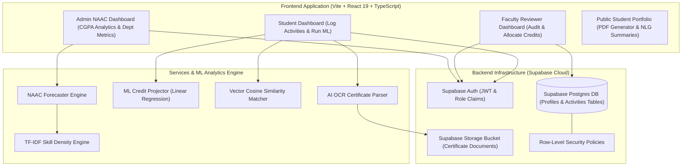

<div align="center">

# 🎓 Edutwin AI
### Centralised Digital-Twin Platform for Student Activity Records & Institutional NAAC Accreditation Forecasting in HEIs

[](https://react.dev/)
[](https://www.typescriptlang.org/)
[](https://vitejs.dev/)
[](https://tailwindcss.com/)
[](https://supabase.com/)
[](https://opensource.org/licenses/MIT)

<p align="center">
  <b>Transforming higher education administration with AI OCR, predictive ML credit projections, TF-IDF skill density mapping, vector-based career alignment, and automated NAAC institutional CGPA forecasting.</b>
</p>

</div>

---

## 📌 Executive Summary

**Edutwin AI** is an institutional digital-twin ecosystem built specifically for Higher Education Institutions (HEIs). Traditional manual certificate collection and credit auditing workflows suffer from data fragmentation, verification delays, and lack of real-time insights into institutional accreditation standards (such as **NAAC**).

Edutwin AI bridges this gap by deploying an intelligent, multi-role digital platform that standardizes student activity logging, automates faculty credit verification, dynamically maps department-wide skill vectors, and delivers real-time accreditation CGPA forecasting for academic leadership.

---

## ✨ Key Platform Capabilities

### 🤖 1. AI-Powered OCR & Certificate Parser
- Extracts critical activity data directly from uploaded certificates, including **Event Title**, **Category**, **Organizing Body**, and **Date**.
- Generates an **AI Confidence Score (%)** and suggests credit allocation to streamline faculty verification workflows.

### 📈 2. ML Graduation Credit Projector
- Implements linear regression models to analyze individual participation velocity.
- Projects expected credit accumulation by graduation, highlighting students requiring academic intervention or credit acceleration.

### 🧠 3. TF-IDF Departmental Skill Density Engine
- Analyzes unstructured text in verified achievement logs using **TF-IDF (Term Frequency-Inverse Document Frequency)** classification algorithms.
- Dynamically maps department-level core competencies (e.g. *Software Development, Machine Learning, Leadership, Research & Publications*).

### 🎯 4. Cosine Similarity Career Alignment Matcher
- Converts verified student skill profiles into high-dimensional vector representations.
- Evaluates **Cosine Similarity** against industry role matrices to output percentage job readiness and personalized skill gap recommendations.

### 🏆 5. Institutional NAAC Accreditation Forecaster
- Computes institutional CGPA metrics (scaled from **0.00 to 4.00**) in real time based on departmental student participation density and verified co-curricular achievements.
- Provides institutional leadership with actionable data breakdowns across engineering, management, and science departments.

### 🛡️ 6. Multi-Tiered Role-Based Access Control (RBAC)
- Dedicated, secure dashboards customized for three institutional stakeholders:
  - **Students**: Log achievements, track credit progress, run ML projections, and view career match vectors.
  - **Faculty Reviewers**: Audit pending student submissions, review AI confidence ratings, adjust credits, and leave feedback.
  - **System Admins**: Institutional analytics, NAAC CGPA breakdown, departmental metrics, and system-wide audit controls.

### 📄 7. Dynamic NLG Resume & Public PDF Portfolio
- Automatically compiles student achievement records into shareable web portfolios with custom **Natural Language Generation (NLG)** summaries.
- Supports native browser print-to-PDF formatting for institutional submissions and employer sharing.

---

## 🗺️ System Architecture



---

## 👥 Role-Based Capabilities Matrix

| Feature / Capability | Student | Faculty Reviewer | Admin |
| :--- | :---: | :---: | :---: |
| Certificate Upload & AI OCR Extraction | ✅ | — | — |
| View Individual Credit Velocity & ML Projection | ✅ | — | — |
| Vector Cosine Career Skill Matcher | ✅ | — | — |
| Audit & Verify Student Submissions | — | ✅ | ✅ |
| Custom Credit Allocation & Feedback | — | ✅ | ✅ |
| Departmental Skill Density Visualizer | — | ✅ | ✅ |
| Institutional NAAC Accreditation CGPA Forecaster | — | — | ✅ |
| Public Portfolio & PDF Resume Export | ✅ | ✅ | ✅ |

---

## 🛠️ Technology Stack

| Layer | Technology | Purpose & Usage |
| :--- | :--- | :--- |
| **Frontend Framework** | **React 19** | Modern UI component rendering with high reactivity |
| **Language** | **TypeScript 6** | End-to-end static type safety and contract enforcement |
| **Build Tool** | **Vite 8** | Rapid bundling, HMR, and lightning-fast developer experience |
| **Styling & UI** | **Tailwind CSS v4** | Design system tokens, responsive glassmorphism & 3D micro-interactions |
| **Icons & Visuals** | **Lucide React** | Clean, accessible SVG icons |
| **Database** | **Supabase Postgres** | Relational data persistence for profiles and activity records |
| **Authentication** | **Supabase Auth** | Secure authentication handling role-based state |
| **Security Layer** | **Supabase RLS** | Row Level Security enforcing strict data isolation per user |
| **Storage** | **Supabase Storage** | Public/Private cloud bucket storing student certificates |
| **Hosting & CI/CD** | **Vercel** | Edge deployment and continuous integration |

---

## 📂 Project Directory Structure

```text
Edutwin-AI/
├── .env                       # Environment configuration (Supabase keys)
├── .gitignore                 # Excluded dependencies and build artifacts
├── EDUTWIN_AI_PROJECT_REPORT.md # Comprehensive institutional research report
├── EDUTWIN_AI_PROJECT_REPORT.pdf # Full formatted PDF project document
├── README.md                  # Project documentation
├── eslint.config.js           # ESLint linting configuration
├── index.html                 # HTML application shell
├── package.json               # Package dependencies & scripts
├── public/                    # Static assets & public resources
├── src/
│   ├── App.tsx                # Client-side router configuration
│   ├── main.tsx               # Bootstrap & 3D parallax interaction engine
│   ├── index.css              # Custom Tailwind directives & SaaS design tokens
│   ├── assets/                # App image assets & logos
│   ├── components/            # Reusable UI components (Navbar, CustomButton, etc.)
│   ├── lib/                   # Supabase client initialization
│   ├── pages/                 # Role-based page views
│   │   ├── Activities.tsx     # Student Activity Logging & OCR interface
│   │   ├── AdminDashboard.tsx # Institutional Analytics & NAAC Forecaster
│   │   ├── FacultyDashboard.tsx# Faculty Verification & Audit Panel
│   │   ├── Login.tsx          # Authentication login view
│   │   ├── Portfolio.tsx      # Public Student Portfolio & PDF Export
│   │   ├── Profile.tsx        # User profile settings & register metadata
│   │   ├── Register.tsx       # Student & Faculty registration view
│   │   └── StudentDashboard.tsx# Student overview & ML credit predictor
│   ├── services/              # API & database service layer
│   │   ├── activityService.ts # Activity CRUD, metadata serialization & joins
│   │   ├── authService.ts     # User authentication handling
│   │   ├── profileService.ts  # User profile fetching & upserting
│   │   └── storageService.ts  # Certificate document storage uploads
│   └── types/                 # Centralized TypeScript interface definitions
│       └── index.ts           # Core types (Profile, Activity, NAACSummary, etc.)
├── supabase_setup.md          # SQL database schemas, triggers & RLS policies
├── tsconfig.json              # TypeScript compiler configuration
├── vercel.json                # Vercel deployment configuration
└── vite.config.ts             # Vite build & plugin configurations
```

---

## 📦 Quick Start & Local Setup

### 1. Prerequisites
Ensure you have the following installed on your machine:
- **Node.js** (v18.0.0 or higher)
- **npm** (v9.0.0 or higher) or **pnpm** / **yarn**
- A **Supabase** account (Free tier works perfectly)

### 2. Clone the Repository
```bash
git clone https://github.com/Mugilan-md/Edutwin-AI.git
cd Edutwin-AI
```

### 3. Install Dependencies
```bash
npm install
```

### 4. Environment Variables Setup
Create a `.env` file in the project root directory:
```env
VITE_SUPABASE_URL=https://your-supabase-project-id.supabase.co
VITE_SUPABASE_ANON_KEY=your-supabase-anon-public-key
```

### 5. Database Schema Initialization
1. Open your Supabase Project Console.
2. Navigate to the **SQL Editor**.
3. Copy the database setup script from [`supabase_setup.md`](./supabase_setup.md).
4. Run the query to create tables (`profiles`, `activities`), enable **Row Level Security (RLS)**, and apply policies.

### 6. Start Development Server
```bash
npm run dev
```
Open your browser at `http://localhost:5173`.

### 7. Production Build Verification
To compile the TypeScript project and bundle production artifacts:
```bash
npm run build
```

---

## 🔒 Security & Database Policy Design

Edutwin AI enforces security at both the application level and database layer using **Supabase Row Level Security (RLS)**:

- **Profiles Table**:
  - `SELECT`: Public access to view student profiles for portfolio generation.
  - `INSERT` / `UPDATE`: Users can only edit their own profile matching `auth.uid()`.
- **Activities Table**:
  - `SELECT`: Students can view their own activities; Faculty and Admins can view all pending/approved activities.
  - `INSERT`: Students can insert activities bound to `student_id = auth.uid()`.
  - `UPDATE`: Faculty and Admins can update status, credits, and feedback.

---

## 📜 License

Distributed under the **MIT License**. See `LICENSE` for details.

---

<div align="center">
  <sub>Built by ❤️  <b>B . MUGILAN</b></sub>
</div>
